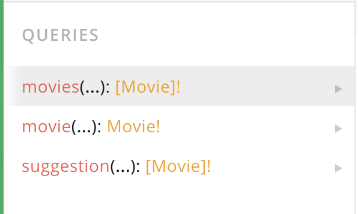
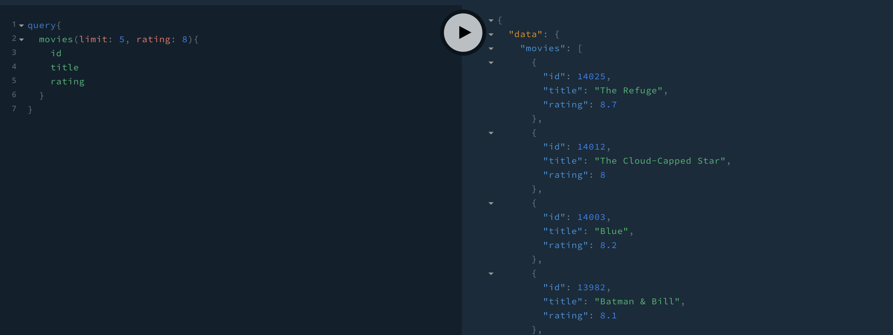
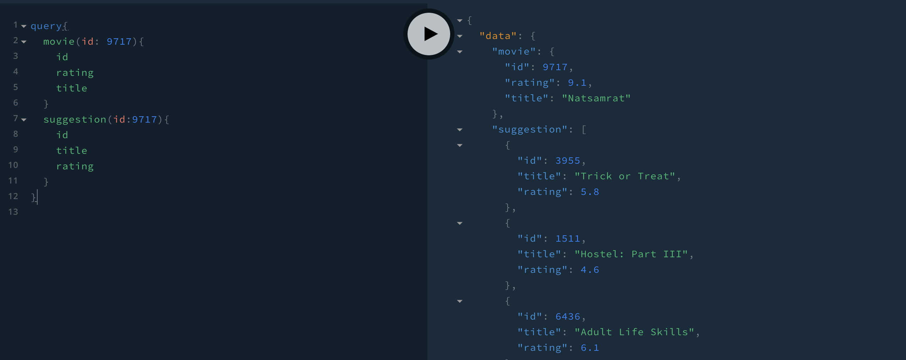
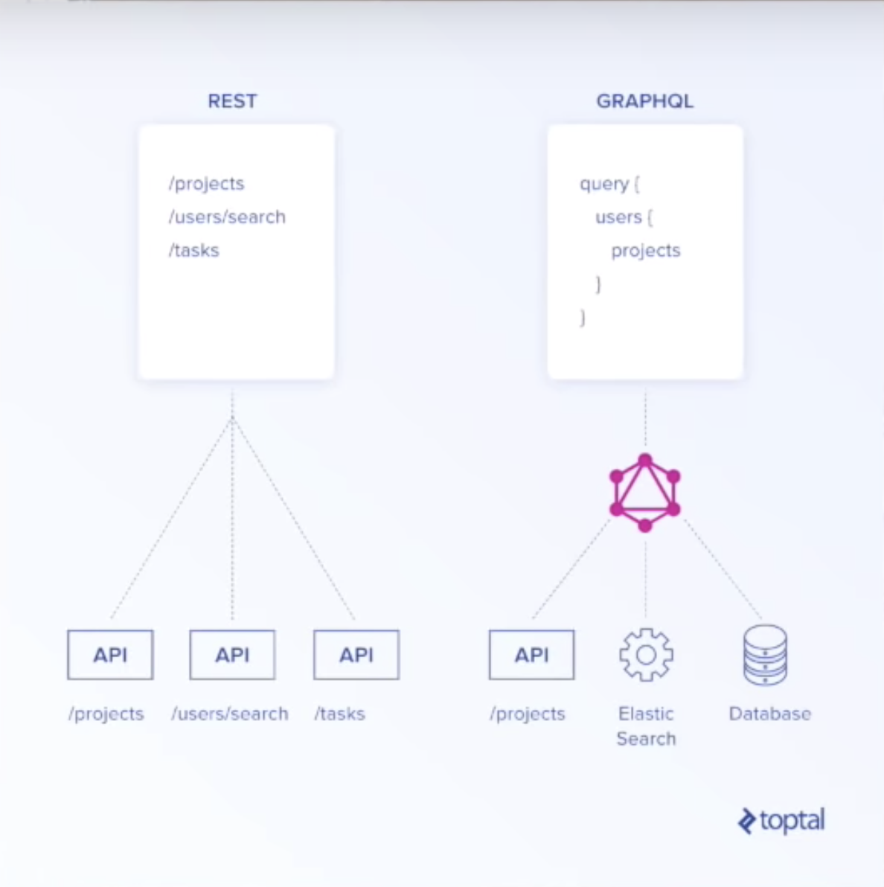

# movieQL

Movie API with GraphQL

# Contents

- [movieQL](#movieql)
- [Contents](#contents)
  - [Output](#output)
  - [nodemon](#nodemon)
  - [babel-node](#babel-node)
  - [node-fetch](#node-fetch)
  - [axios](#axios)
  - [<a href="https://github.com/prisma-labs/graphql-yoga">graphql-yoga</a>](#graphql-yoga)
  - [GraphQL](#graphql)
  - [schema](#schema)
  - [playground](#playground)

## Output

Backend for the web site recommending movies with Graphql + Nodejs + REST API.
backend에서 만든 graphql의 query들을 front-end에서 graphql로 사용함으로써 REST API를 썼을 때 발생하는 over-fetching, under-fetching문제를 해결하여 더욱 간결하게 data를 받아올 수 있다.





## nodemon

> \$yarn global add nodemon

- 1. 파일을 수정할 때마다 서버를 재시작 해준다.
- 2.  nodemon 실행

> package.json 수정

```js
"scripts": {
    "start": "nodemon index.js"
}
```

## babel-node

babel은 멋진 코드를 못생긴 코드로 바꿔주는 도구다. 멋진코드는 아직 지원해주지 않는 곳들이 많아서 못생긴 코드로 바꿔줘야 한다. 간단하게 말하면 ES6 사용할 수 있게 해준다. (import같은것들)

> \$yarn add babel-node --dev
> \$yarn add babel-cli babel-preset-env babel-preset-stage-3 --dev

- 1. package.json

```js
"script": {
    "start" : "nodemon --exec babel-node index.js"
}
```

- 2. .bablerc

```js
{
  "presets": ["env", "stage-3"]
}
```

## node-fetch

> \$yarn add node-fetch

nodejs에서 fetch를 쓸 때 필요하다

## axios

> \$yarn add axios

node-fetch를 axios로 바꿨다.
we can use asynchronous by axios

## [graphql-yoga](https://github.com/prisma-labs/graphql-yoga)

- 1. Fully-featured GraphQL Server with focus on easy setup, performance & great developer experience
- 2. 이것은 마치 react에서 create-react-app 과같이 graphql을 시작하기 쉽도록 초기 설정들을 하기 쉽게 도와주는 도구이다.

## GraphQL

- 1. Graphql 장점 (REST를 대체하는 이유)
     REST API는 URL이나 URL parameter등이 필요하고 form-data를 전송해야 하고 body-parse를 해야 하는 등 복잡한데, graphql 은 그런 것이 필요 없이 schema와 resolver로 대체 할 수 있다.
     > 차이점이 무엇인지 더 알아보자

- 1.1 over-fetching 해결

/user</br>
예를 들어, 모든 유저들 이름을 웹사이트에 보여주고 있다면 GET을 쓸것이다. 근데 users에서 나한테 사용자 명만 주는게 아니라 성이나 프로필 사진 같은것도 줄 것이다. 유저들의 모든 정보를!! 이렇게 되면 나의 Database가 쓸데없는 영역을 보게 만들고 고객들이 나의 앱에서 필요도 없는 정보들을 받게 할거다.
이걸 over-fetching이라고 한다. 비효율적이고 개발자들이 뭘 받았는지 한눈에 알기 힘들다. 요청을 보고, 모든 object들을 받아서 작업을 하기 위해 “ 오 모든 object를 다 받았지만, 난 사용자명만 쓸거야~” 이렇게 된다. 즉, graphQL은 over-fetching없이 코드를 짤 수 있게 하고 개발자가 어떤 정보를 원하는 지에 대해 통제할 수 있다. frontend가 database에 오직 사용자명만 요청하는 것처럼!

- 1.2 under-fetching 해결

  /feed</br>
  /users/1</br>
  /notification</br>

underfetching은 어떤 하나를 완성하기 위해 다른 요청들을 해야할 때! 예를 들면 앱을 처음 시작할 때 세가지 요청을 하고싶다면, 원래는 3가지 요청이 3번 오고가야 앱이 시작됐다. 이게 under-fetching이다. REST에서 하나를 완성하려고 많은 소스를 요청하는 것!

- 1.3 편리성
  프론트엔드에서 사용하려면 fetch로 API를 가져와야 했다. Json, Response등등 작업을 해야 한다. 하지만 Apollo를 활용하면 fetch, Json, Props 등등을 다 대신해줘서 직접 할 필요가 없어 진다. Query만 잘 써주면 된다.

- 1.4 react와의 결합이 아주 스무쓰하다
  엔드포인트(?)가 1개이고, 세팅, 설정 이런거 다 안해도 된다.

- 1.5 state management를 하는 리덕스를 대체할 수 있다.
  graphql을 사용하면 어플리케이션의 Local state를 관리할 수 있게 된다.

- 2 실제 코드에서의 graphql
  
  Over-fetching, Under-fetching을 겪을 필요 없이 한 query를 통해서 원하는 정보만 받을 수 있다.

> graphql

```

query {
    feed {
        comments
        likeNumber
    }
    notification {
        isRead
    }
    users {
        username
        picture
    }
}

```

> javascript object

```js
{
    feed : [
        {
            commnets : 1,
            likeNumber: 20

        }
    ],
    notificadtion : [
        {
            isRead : true
        },
        {
            isRead : true
        },
        {
            isRead : false
        }
    ],
    users :{
            username: "nick",
            picture : "url"
    }

}
```

위와 같은 query를 backend에 보내면 위와 같은 요청 정보를 담은 object를 보낼 것이다.
좀만 기다려 봐 내가 필요한 정보들만을 어떻게 알려줄 수 있을까? 예를 들어, 이 모든 것들을 한 URL에서 받는거야 이게 생각하는 방식을 바꾸는 첫 지점이야 GraphQL에서 URL은 존재하지 않아 URL 체계도 없고, 저런 URL도 당연히 없어 하나의 종점만 있을 뿐이야 이걸 api로 하든 graphql로 하든 아무거나 가능해 하지만 오직 하나만 있는거야 상상해 봐 아마 이거에 대해 몰랐을 것 같아. 예를 들어 이 모든 것들을 GraphQL에선, 한개의 query로 만들 수 있어 Query는 Database에서 무언가를 요청하고 GraphQL 언어로 내가 원하는 정보를 알려줄 수 있어 예를 들어, 피드를 원하는데 모든 사진 피드 중에 댓글이랑 좋아요 수! 를 원하고. 알림을 원하고, 그 알림을 확인했는지 대한 정보를 원하며, 유저 프로필을 원하는데, 사용자명과 프로필 사진을 원한다고 하자 이게 Query야 이걸 GraphQL의 Backend에 보내면 이게 이와 같은 요청 정보를 담은 Object를 보낼거야 이게 GraphQL 언어고, 이건 JavaScript야 피드에 댓글들, 좋아요 수가 있고 이게 반복될거야. 알림도 여러개일거니까 array일거고, 유저에서 사용자명과 프로필을 받을거야! 이게 GraphQL에 보낼 거고 이게 GraphQL에서 보낸 JavaScript Object야 네가 요청한 것만 정확하게 보내주지 AMAZING! AWESOME! 네가 요청한 정보들만 받을 수 있고 네가 원하는 방식으로 조정할 수도 있어 API로 조정하거나 여러가질 섞어서 모양을 바꾸거나...할 수 있어

## schema

- 1. schema
     내가 사용자에게 보낼 데이터 or 사용자로부터 받을 데이터에 대한 설명이다. 따라서 우리가 Graphql 서버에 해야할 것은 어떤 Mutation을 가졌는지, 어떤 Query들을 가졌는지 알려주는 것이다.
     schema는 REST API에서 url 같은 것이다. 어디로 갈지 알려주니까!

- 1.1 Query
  내가 데이터를 받을 때 쓴다.

- 1.2 Mutation
  서버 혹은 데이터 베이스에서 데이터를 변경하는 작업을 할 때 쓰인다.

- 2. resolver
     query가 요청이 됐을때, 서버쪽에서 어떻게 해결해 주어야 할 지 해결해주는(resolve) 것이다. in javascript
     resolver는 내가 원하는데로 프로그래밍 할 수 있다. 진짜 그냥 함수이다! database갈 수 도있고 다른 api를 사용할 수도 있다.
     Resolver는 view와 비슷하다

## playground

- 1. graphql-yoga에 딸려 있는 것이다.
- 2. database를 테스트 할 수 있게 해준다. 마치 postman과 비슷하다.
- 3. query, mutation을 POST로 보낸다. => 서버가 받는다.
